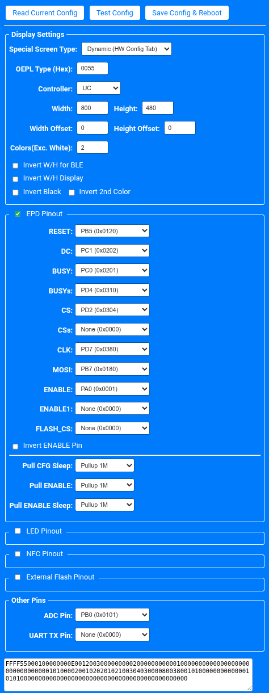

# Picksmart 7.5-inch Double-Sided BLE ESL

Reverse-engineering and hardware reference for a **Picksmart 7.5-inch double-sided Bluetooth E-Ink conference/table display**.

This unit has been successfully reflashed with **ATC_BLE_OEPL** and both 7.5-inch E-Ink panels are working.

> [!IMPORTANT]
> Both screens currently display the **same image**.
>
> The hardware is physically dual-display, with one 7.5-inch panel on each side, but the current ATC_BLE_OEPL configuration drives them as duplicated displays. Independent images on the two panels have **not yet been implemented**.
>
> The hardware appears capable of separate panel control, so independent front/back images may be possible with firmware changes.

## Hardware

| Item | Details |
|---|---|
| Manufacturer | Picksmart |
| Product type | Double-sided Bluetooth E-Ink conference / table display |
| PCB marking | `PK_TL_ESL_V5.2_7.5inch` |
| MCU | `TLSR8250F512ET32` |
| Display panels | `2 × GDEY075Z08` |
| Resolution | `800 × 480` per panel |
| Display controller | `UC8179` |
| Display type | 3-colour E-Ink |
| Wireless | Bluetooth Low Energy / 2.4 GHz |
| External flash | `FM25Q16A` 16-Mbit SPI NOR flash |
| Firmware tested | `ATC_BLE_OEPL` |

## Display behaviour

The device contains two separate **GDEY075Z08** E-Ink panels:

- one display on each side;
- each panel is `800 × 480`;
- both are currently driven with the same framebuffer/image;
- updating the display refreshes both panels;
- separate front/back images are not currently exposed by ATC_BLE_OEPL.

This is therefore currently treated as:

```text
800 × 480 image
       │
       ├── Front GDEY075Z08
       └── Rear  GDEY075Z08
```

rather than two independently addressable displays.

## Programming header

The five-pin header on the left edge of PCB revision:

```text
PK_TL_ESL_V5.2_7.5inch
```

was mapped by continuity testing against the TLSR8250.

With the PCB oriented normally and the **square pad at the top**:

```text
TOP

1  ■  VCC
2  ●  RESETB
3  ●  GPIO / TEST
4  ●  SWS
5  ●  GND

BOTTOM
```

### Header mapping

| Header pin | Signal | MCU connection | Notes |
|---|---|---|---|
| 1 | VCC | Power rail | 3.3 V only |
| 2 | RESETB | TLSR8250 pin 25 | Active-low reset |
| 3 | GPIO / test | TLSR8250 pin 1 | Not required for normal flashing |
| 4 | SWS | TLSR8250 pin 5 | Telink single-wire programming |
| 5 | GND | Ground | Common ground |

### Typical SWS flashing connection

```text
Picksmart          USB-UART / Telink SWS programmer

Pin 4  SWS      -> TX / SWS
Pin 5  GND      -> GND
Pin 2  RESETB   -> RTS / Reset    (optional, but useful)
Pin 1  VCC      -> 3.3 V          (only if powering from programmer)
Pin 3  GPIO     -> Not connected
```

> [!WARNING]
> Do **not** apply 5 V to the programming header.
>
> If the board is already powered from its battery, avoid connecting a second power source unless you know the supplies can safely be tied together.

## ATC_BLE_OEPL hardware configuration

The following configuration has been used successfully with this device.

### Display settings

| Setting | Value |
|---|---|
| Special Screen Type | `Dynamic (HW Config Tab)` |
| OEPL Type (Hex) | `0055` |
| Controller | `UC` |
| Width | `800` |
| Height | `480` |
| Width Offset | `0` |
| Height Offset | `0` |
| Colours excluding white | `2` |
| Invert W/H for BLE | Off |
| Invert W/H Display | Off |
| Invert Black | Off |
| Invert 2nd Colour | Off |

### EPD pinout

| Function | ATC_BLE_OEPL setting |
|---|---|
| RESET | `PB5 (0x0120)` |
| DC | `PC1 (0x0202)` |
| BUSY | `PC0 (0x0201)` |
| BUSYs | `PD4 (0x0310)` |
| CS | `PD2 (0x0304)` |
| CSs | `None (0x0000)` |
| CLK | `PD7 (0x0380)` |
| MOSI | `PB7 (0x0180)` |
| ENABLE | `PA0 (0x0001)` |
| ENABLE1 | `None (0x0000)` |
| FLASH_CS | `None (0x0000)` |
| Invert ENABLE Pin | Off |

### Pull configuration

| Setting | Value |
|---|---|
| Pull CFG Sleep | `Pullup 1M` |
| Pull ENABLE | `Pullup 1M` |
| Pull ENABLE Sleep | `Pullup 1M` |

### Other pins

| Function | Setting |
|---|---|
| ADC Pin | `PB0 (0x0101)` |
| UART TX Pin | `None (0x0000)` |

### Configuration screenshot



## Firmware / image uploader

The browser-based ATC_BLE_OEPL image uploader is:

**https://atc1441.github.io/ATC_BLE_OEPL_Image_Upload.html**

This can be used to connect to a flashed tag over BLE and send images to the display.

ATC project / firmware resources:

- https://github.com/atc1441/atc1441.github.io
- https://atc1441.github.io/ATC_BLE_OEPL_Image_Upload.html

## Main components

### Telink TLSR8250F512ET32

The main MCU is:

```text
TLSR8250
F512ET32
```

The TLSR8250 is a low-power 2.4 GHz wireless MCU from Telink's TLSR825x family and provides the BLE radio and application processor.

The board uses the Telink **SWS / SWire** programming/debug interface.

### FM25Q16A

The SOIC-8 device below the MCU is marked:

```text
FM25Q16A
```

This is a **16-Mbit / 2 MB SPI NOR flash** device.

Its exact use in the original Picksmart firmware has not yet been fully documented.

### GDEY075Z08

The device uses:

```text
2 × GDEY075Z08
```

7.5-inch E-Ink panels.

Each panel is:

```text
800 × 480
```

and uses the **UC8179** controller family.

## Known state

### Confirmed

- Picksmart double-sided conference/table display.
- PCB revision `PK_TL_ESL_V5.2_7.5inch`.
- MCU is `TLSR8250F512ET32`.
- External flash is `FM25Q16A`.
- Two `GDEY075Z08` 7.5-inch panels.
- Resolution is `800 × 480`.
- Display controller is `UC8179`.
- ATC_BLE_OEPL can be flashed and run successfully.
- Both screens update successfully.
- Both screens currently duplicate the same image.
- Five-pin programming header mapping documented above.

### Still to investigate

- Independent front/rear image control.
- Whether each panel has a separately controllable chip-select or enable path in hardware.
- Original Picksmart factory firmware.
- Full GPIO mapping for both panel interfaces.
- Exact role of the external SPI flash.
- Battery/charging/power-management IC identification.
- Original Picksmart BLE protocol and configuration process.

## Product family

The board comes from Picksmart's double-sided electronic conference / office signage range.

These devices were sold as battery-powered E-Ink nameplates / conference displays intended for applications such as:

- meeting rooms;
- boardrooms;
- conference tables;
- desk/name signage;
- schedules and booking information.

The exact commercial SKU for PCB revision `PK_TL_ESL_V5.2_7.5inch` has not yet been confirmed.

## Notes for other hardware revisions

Do not assume this pinout applies to every Picksmart 7.5-inch product.

Picksmart produced multiple:

- Bluetooth;
- Wi-Fi;
- base-station;
- single-sided;
- double-sided;

variants.

Always check the PCB revision and continuity-test the programming header before applying power or a programmer.

## Contributions

Additional reverse-engineering information is welcome, particularly:

- GPIO traces;
- original firmware dumps;
- independent dual-panel support;
- charging/power IC identification;
- original Picksmart protocol details;
- alternative firmware support.
